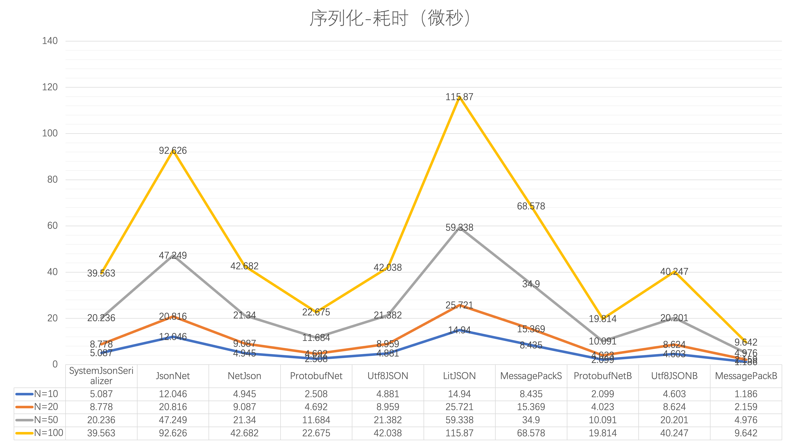

# Console App

## 测试对象

使用 C# 内置数据类型创建的类用于基准测试，注解 `ProtoContract`、`ProtoMember` 属于 Protobuf-net，注解 `MessagePackObject`、 `Key` 属于 MessagePack。

```csharp
    [MessagePackObject]
    [ProtoContract]
    [Serializable]
    public class BuiltInClass
    {
        [Key(1)]
        [ProtoMember(1)]
        public bool Bool { get; set; }
        [Key(2)]
        [ProtoMember(2)]
        public byte Byte { get; set; }
        [Key(3)]
        [ProtoMember(3)]
        public sbyte Sbyte { get; set; }
        [Key(4)]
        [ProtoMember(4)]
        public char Char { get; set; }
        [Key(5)]
        [ProtoMember(5)]
        public decimal Decimal { get; set; }
        [Key(6)]
        [ProtoMember(6)]
        public double Double { get; set; }
        [Key(7)]
        [ProtoMember(7)]
        public float Float { get; set; }
        [Key(8)]
        [ProtoMember(8)]
        public int Int { get; set; }
        [Key(9)]
        [ProtoMember(9)]
        public uint Uint { get; set; }
        [Key(10)]
        [ProtoMember(10)]
        public long Long { get; set; }
        [Key(11)]
        [ProtoMember(11)]
        public ulong Ulong { get; set; }
        [Key(12)]
        [ProtoMember(12)]
        public short Short { get; set; }
        [Key(13)]
        [ProtoMember(13)]
        public ushort Ushort { get; set; }

        //[Key(14)]
        //[ProtoMember(14)]
        //public bool[]? BoolArray { get; set; }
        //[Key(15)]
        //[ProtoMember(15)]
        //public byte[]? ByteArray { get; set; }
        [Key(16)]
        [ProtoMember(16)]
        public sbyte[]? SbyteArray { get; set; }
        //[Key(17)]
        //[ProtoMember(17)]
        //public char[]? CharArray { get; set; }
        [Key(18)]
        [ProtoMember(18)]
        public decimal[]? DecimalArray { get; set; }
        [Key(19)]
        [ProtoMember(19)]
        public double[]? DoubleArray { get; set; }
        [Key(20)]
        [ProtoMember(20)]
        public float[]? FloatArray { get; set; }
        [Key(21)]
        [ProtoMember(21)]
        public int[]? IntArray { get; set; }
        [Key(33)]
        [ProtoMember(22)]
        public uint[]? UintArray { get; set; }
        [Key(23)]
        [ProtoMember(23)]
        public long[]? LongArray { get; set; }
        //[Key(24)]
        //[ProtoMember(24)]
        //public ulong[]? UlongArray { get; set; }
        [Key(25)]
        [ProtoMember(25)]
        public short[]? ShortArray { get; set; }
        [Key(26)]
        [ProtoMember(26)]
        public ushort[]? UshortArray { get; set; }

        [Key(27)]
        [ProtoMember(27)]
        public string? String { get; set; }
        [Key(28)]
        [ProtoMember(28)]
        public string[]? StringArray { get; set; }


        public override string ToString()
        {
            return "Bool: " + Bool + "\n" +
                "Byte: " + Byte + "\n" +
                "Sbyte: " + Sbyte + "\n" +
                "Char: " + Char + "\n" +
                "Decimal: " + Decimal + "\n" +
                "Double: " + Double + "\n" +
                "Float: " + Float + "\n" +
                "Int: " + Int + "\n" +
                "Uint: " + Uint + "\n" +
                "Long: " + Long + "\n" +
                "Ulong: " + Ulong + "\n" +
                "Short: " + Short + "\n" +
                "Ushort: " + Ushort + "\n" +
                //"BoolArray: " + string.Join(", ", BoolArray) + "\n" +
                //"ByteArray: " + string.Join(", ", ByteArray) + "\n" +
                "SbyteArray: " + string.Join(", ", SbyteArray) + "\n" +
                //"CharArray: " + string.Join(", ", CharArray) + "\n" +
                "DecimalArray: " + string.Join(", ", DecimalArray) + "\n" +
                "DoubleArray: " + string.Join(", ", DoubleArray) + "\n" +
                "FloatArray: " + string.Join(", ", FloatArray) + "\n" +
                "IntArray: " + string.Join(", ", IntArray) + "\n" +
                "UintArray: " + string.Join(", ", UintArray) + "\n" +
                "LongArray: " + string.Join(", ", LongArray) + "\n" +
                //"UlongArray: " + string.Join(", ", UlongArray) + "\n" +
                "ShortArray: " + string.Join(", ", ShortArray) + "\n" +
                "UshortArray: " + string.Join(", ", UshortArray) + "\n" +
                "String: " + String + "\n" +
                "StringArray: " + string.Join(", ", StringArray) + "\n";
        }
    }
```

测试对象使用 [Bogus](https://github.com/bchavez/Bogus) 随机生成，`count` 参数用于控制数组大小。

```csharp
    class BuiltInClassFaker : Faker<BuiltInClass>
    {
        public BuiltInClassFaker(int count)
        {
            RuleFor(o => o.Bool, f => f.Random.Bool());
            RuleFor(o => o.Byte, f => f.Random.Byte());
            RuleFor(o => o.Sbyte, f => f.Random.SByte());
            RuleFor(o => o.Char, f => f.Random.Char());
            RuleFor(o => o.Decimal, f => f.Random.Decimal());
            RuleFor(o => o.Double, f => f.Random.Double());
            RuleFor(o => o.Float, f => f.Random.Float());
            RuleFor(o => o.Int, f => f.Random.Int());
            RuleFor(o => o.Uint, f => f.Random.UInt());
            RuleFor(o => o.Long, f => f.Random.Long());
            RuleFor(o => o.Ulong, f => f.Random.ULong());
            RuleFor(o => o.Short, f => f.Random.Short());
            RuleFor(o => o.Ushort, f => f.Random.UShort());

            //RuleFor(o => o.BoolArray, f => Enumerable.Range(1, count).Select(_ => f.Random.Bool()).ToArray());    // NetJSON 反序列化时索引越界
            //RuleFor(o => o.ByteArray, f => Enumerable.Range(1, count).Select(_ => f.Random.Byte()).ToArray());    // 元素个数超过 20 后 MessagePack 反序列化时出错 MessagePack.MessagePackSerializationException: Unexpected msgpack code 217 (str 8) encountered. https://matrix.to/#/!OsUCGXdUrZWVaTcHrr:gitter.im/$Rf7nPebsIL8PR97xZjvGjj-iiigKSnXzqrvm6FEtrY4?via=gitter.im&via=matrix.org
            RuleFor(o => o.SbyteArray, f => Enumerable.Range(1, count).Select(_ => f.Random.SByte()).ToArray());
            //RuleFor(o => o.CharArray, f => Enumerable.Range(1, count).Select(_ => f.Random.Char()).ToArray());    // NetJSON 反序列化时卡住
            RuleFor(o => o.DecimalArray, f => Enumerable.Range(1, count).Select(_ => f.Random.Decimal()).ToArray());
            RuleFor(o => o.DoubleArray, f => Enumerable.Range(1, count).Select(_ => f.Random.Double()).ToArray());
            RuleFor(o => o.FloatArray, f => Enumerable.Range(1, count).Select(_ => f.Random.Float()).ToArray());
            RuleFor(o => o.IntArray, f => Enumerable.Range(1, count).Select(_ => f.Random.Int()).ToArray());
            RuleFor(o => o.UintArray, f => Enumerable.Range(1, count).Select(_ => f.Random.UInt()).ToArray());
            RuleFor(o => o.LongArray, f => Enumerable.Range(1, count).Select(_ => f.Random.Long()).ToArray());
            //RuleFor(o => o.UlongArray, f => Enumerable.Range(1, count).Select(_ => f.Random.ULong()).ToArray());  // LibJson 反序列化时出错 Can't assign value '4756064988429410304' (type System.Int64) to type System.UInt64
            RuleFor(o => o.ShortArray, f => Enumerable.Range(1, count).Select(_ => f.Random.Short()).ToArray());
            RuleFor(o => o.UshortArray, f => Enumerable.Range(1, count).Select(_ => f.Random.UShort()).ToArray());

            RuleFor(o => o.String, f => f.Lorem.Word());
            RuleFor(o => o.StringArray, f => f.Lorem.Words(count));
        }
    }
```

## 测试库

使用 [BenchmarkDotNet](https://github.com/dotnet/BenchmarkDotNet) 执行基准测试，指定数组长度为 10、20、50、100。被测库包括：

- [System.Text.Json.JsonSerializer](https://learn.microsoft.com/en-us/dotnet/api/system.text.json.jsonserializer?view=net-7.0)
- [Newtonsoft.Json](https://github.com/JamesNK/Newtonsoft.Json)
- [NetJSON](https://github.com/rpgmaker/NetJSON)
- [protobuf-net](https://github.com/protobuf-net/protobuf-net)
- [Utf8Json](https://github.com/neuecc/Utf8Json)
- [LitJSON](https://github.com/LitJSON/litjson)
- [MessagePack](https://github.com/neuecc/MessagePack-CSharp)
- [BinaryFormatter](https://learn.microsoft.com/en-us/dotnet/standard/serialization/binary-serialization)


## 问题

1. BinaryFormatter 由于安全风险被禁止使用
2. NetJSON 反序列化 bool 数组时索引越界
3. NetJSON 反序列化 char 数组时卡死
4. LitJson 反序列化 ulong 数组时报错，推测是类型检测错误
5. byte 数组元素个数超过 20 个时，MessagePack 反序列化报错

通过注释上述引起异常的变量解决

## 测试结果

### 序列化




### 反序列化


# Unity Project

## 测试对象

包含 Vector3 变量的自定义类 Save，同样使用 Bogus 填充。

```csharp
public enum State
{
    WaitingToMove,
    Moving
}

[MessagePackObject]
[ProtoContract]
[Serializable]
public class Save
{
    [Key(1)]
    [ProtoMember(1)]
    public State m_State;
    [Key(2)]
    [ProtoMember(2)]
    public float m_CurrentTime;
    [Key(3)]
    [ProtoMember(3)]
    public float m_Pause;

    [Key(4)]
    [ProtoMember(4)]
    public Vector3 m_Offset;
    [Key(5)]
    [ProtoMember(5)]
    public Vector3 m_RotationOffset;
    [Key(6)]
    [ProtoMember(6)]
    public Vector3 m_Pivot;

    [Key(7)]
    [ProtoMember(7)]
    public string m_Title;
    [Key(8)]
    [ProtoMember(8)]
    public string m_Description;
    [Key(9)]
    [ProtoMember(9)]
    public bool m_Lose;
    [Key(10)]
    [ProtoMember(10)]
    public bool m_Hidden;
    [Key(11)]
    [ProtoMember(11)]
    public bool IsCompleted;
}

class SaveFaker : Faker<Save>
{
    public SaveFaker()
    {
        RuleFor(o => o.m_State, f => f.Random.Enum<State>());
        RuleFor(o => o.m_CurrentTime, f => f.Random.Float());
        RuleFor(o => o.m_Pause, f => f.Random.Float());

        RuleFor(o => o.m_Offset, f => new Vector3(f.Random.Float(), f.Random.Float(), f.Random.Float()));
        RuleFor(o => o.m_RotationOffset, f => new Vector3(f.Random.Float(), f.Random.Float(), f.Random.Float()));
        RuleFor(o => o.m_Pivot, f => new Vector3(f.Random.Float(), f.Random.Float(), f.Random.Float()));

        RuleFor(o => o.m_Title, f => f.Lorem.Word());
        RuleFor(o => o.m_Description, f => f.Lorem.Sentence());
        RuleFor(o => o.m_Lose, f => f.Random.Bool());
        RuleFor(o => o.m_Hidden, f => f.Random.Bool());
        RuleFor(o => o.IsCompleted, f => f.Random.Bool());
    }
}
```

## 测试库

将 [Test](./../Test.cs) 脚本附加到 Main Camera 上运行，使用 [Profiler](https://docs.unity3d.com/2021.3/Documentation/Manual/Profiler.html) 监控，被测库包括：

- [JsonUtility](https://docs.unity3d.com/ScriptReference/JsonUtility.html) (Unity Scripting API)
- [System.Text.Json.JsonSerializer](https://learn.microsoft.com/en-us/dotnet/api/system.text.json.jsonserializer?view=net-7.0)
- [Newtonsoft.Json](https://github.com/JamesNK/Newtonsoft.Json)
- [NetJSON](https://github.com/rpgmaker/NetJSON)
- [protobuf-net](https://github.com/protobuf-net/protobuf-net)
- [Utf8Json](https://github.com/neuecc/Utf8Json)
- [LitJSON](https://github.com/LitJSON/litjson)
- [MessagePack](https://github.com/neuecc/MessagePack-CSharp)

## 问题

1. NewtonsoftJson 序列化 Vector3 类型时报错（配置 `ReferenceLoopHandling.Ignore` 解决）
2. NetJson 无法使用
3. protobuf-net 无法解析 Vector3 类型（往 RuntimeTypeModel 添加类型解析解决）
4. Utf8Json 序列化导致 Unity 闪退
5. LitJSON 序列化报 Vector3 类型时报错，需要自行定制
6. MessagePack 无法解析 Vector3（.NET Standard 2.1 切换到 .NET Framework 解决）

## 测试结果

27727 帧


27792 帧


27608-27907（300 帧）


### 序列化


### 反序列化


